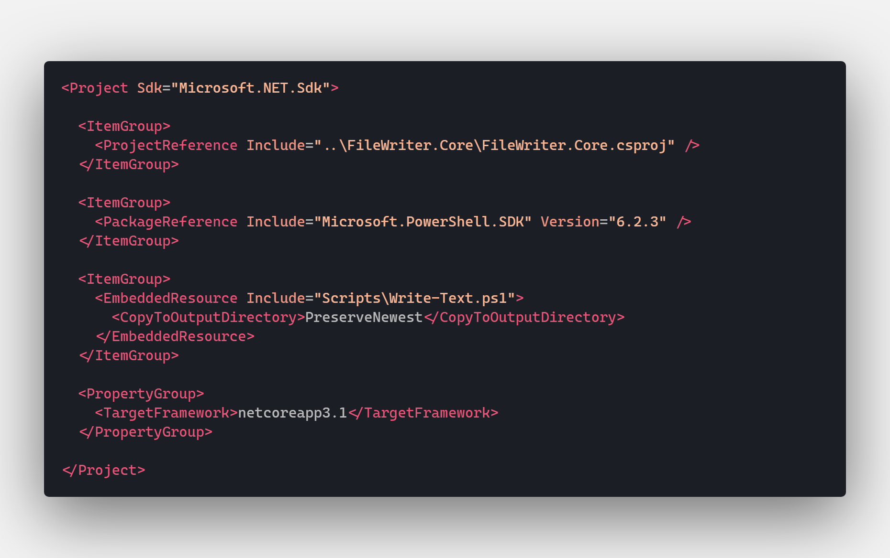
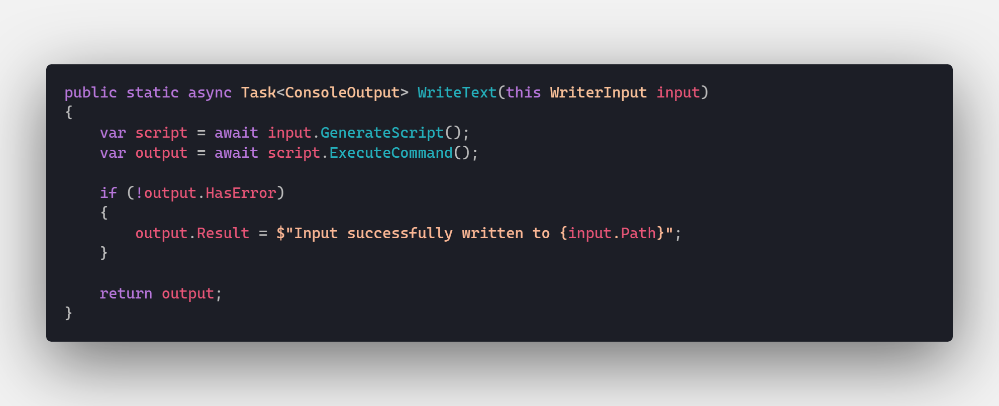

# File Writer - PowerShell SDK with Web API and Angular

* [Scripting](#scripting)
* [API](#api)
* [Client](#client)

This repository is a simple demonstration of how to use a PowerShell script embedded in a .NET Core class library, exposing the functionality of the script to a Web API / Angular web app. This application has been kept very simple to emphasize how data flows and executes between each technology.

  
*click to open*  

> For much more advanced implementations of this features, see my [Portfolio](https://github.com/JaimeStill/Portfolio) and [Mapper](https://github.com/JaimeStill/Mapper) repositories.
>
> The portion of my **Portfolio** repository that uses this feature makes use of an embedded [ffmpeg](https://www.ffmpeg.org/) executable to convert `.mp4` files to `.gif`.
>
> The **Mapper** repository uses PowerShell to automate the generation of `GeoJSON` (as demonstrated by Mike Bostock in his [Command-Line Cartography](https://medium.com/@mbostock/command-line-cartography-part-1-897aa8f8ca2c) article series) so that maps can be rendered using [D3](https://d3js.org/).

## Scripting  
[Back to Top](#file-writer---powershell-sdk-with-web-api-and-angular)

All of the PowerShell-related features are contained in the [src/FileWriter.Scripting](src/FileWriter.Scripting) library. It uses the [Microsoft.PowerShell.SDK](https://www.nuget.org/packages/Microsoft.PowerShell.SDK/) to execute an embedded `.ps1` script in a PowerShell Core runspace on the machine that is hosting the .NET Core app.

[**FileWriter.Scripting/Scripts/Write-Text.ps1**](src/FileWriter.Scripting/Scripts/Write-Text.ps1)

This simple script takes a `path` and a `value` parameter to create a text file at the specified path with the specified value.

In order to access the PowerShell script, it needs to be included in the class library as an **EmbeddedResource**.

[**FileWriter.Scripting/FileWriter.Scripting.csproj**](src/FileWriter.Scripting/FileWriter.Scripting.csproj)

  

Before getting into the functionality of the `.Scripting` library, there are three classes that need to be created to support three important aspects of this app:

* `WriterInput.cs` - Represents the input that will be provided to the script
* `ConsoleOutput.cs` - Represents the output the script will respond with
* `OutputPath.cs` - Allows the base path that files are written to to be configurable

[**FileWriter.Scripting/WriterInput.cs**](src/FileWriter.Scripting/WriterInput.cs)  

  

[**FileWriter.Scripting/ConsoleOutput.cs**](src/FileWriter.Scripting/ConsoleOutput.cs)  

  

[**FileWriter.Scripting/OutputPath.cs**](src/FileWriter.Scripting/OutputPath.cs)  

  

Now, all of the infrastructure needed to define the PowerShell interactions is in place. The logic for these interactions is contained in [ScriptExtensions.cs](src/FileWriter.Scripting/Extensions/ScriptExtensions.cs).

First up, if a script ends in an error state, we want to be able to extract that data in an consistent, readable manner. This is done by the `GetCategoryInfo(this ErrorRecord error)` extension method:

  

After the invocation of a command is complete, we need to be able to extract the details of the command execution from the powershell stream, which is handled by `GetPowershellOutput(this PowerShell ps)`:

  

Creating a PowerShell runspace, invoking a command, and returning the output is a task that can be isolated, so it is defined by the `ExecuteCommand(this Command command)` extension method:

  

Before a command can be created, a script must be read as text from an embedded resource. `GetTextFromEmbeddedResource(this string resource)` handles this:

  

Now an extension method, `GenerateScript(this WriterInput input)`, can be written to generate a command that loads the script, and map values provided by a `WriterInput` object as parameters to the script:

  

The final extension method, `WriteText(this WriterInput input)` pulls everything together. The command is generated, executed, and the resulting output is returned:

  

## API
[Back to Top](#file-writer---powershell-sdk-with-web-api-and-angular)  

In the previous section, I mentioned that the base path that files are written to should be configurable, and showed an `OutputPath` class defined. Using the dependency injection mechanism in .NET Core, this can be achieved.

An `AppDirectory` variable is defined in [FileWriter.Web/appsettings.json](src/FileWriter.Web/appsettings.json):

  

An instance of `OutputPath` is then registered as a Singleton in the `ConfigureServices(IServiceCollection services)` method of [FileWriter.Web/Startup.cs](src/FileWriter.Web/Startup.cs):

  

Now, an API can be written that allows for the following features:

* `GetOutputFiles()` - Enumerates all of the files at the output path
* `WriteText([FromBody]WriterInput input)` - Executes the `WriteText()` extension method from the `FileWriter.Scripting` library, and returns the output
* `RemoveOutputFile([FromBody]KeyValuePair<string, string> path)` - Deletes the specified file from the output path

[**FileWriter.Web/Controllers/AppController.cs**](src/FileWriter.Web/Controllers/AppController.cs)  

  

## Client
[Back to Top](#file-writer---powershell-sdk-with-web-api-and-angular)  

All that's left now is to create a simple Angular interface. There are 3 pieces to this:

* Models - provide interfaces for mapping the shape of the data that will interact with the API
* Service - provides state management and functions for interacting with the API
* Route - the UI that will allow for this interaction

> In a production application, this would all be a lot more complicated, but I've kept it simple for the purposes of this demonstration.
>
> The remainder of the application is pretty self-explanatory. For the most part, I'll allow the remaining code to speak for itself.

[**FileWriter.Web/ClientApp/src/app/models/console-output.ts**](src/FileWriter.Web/ClientApp/src/app/models/console-output.ts)  

  

[**FileWriter.Web/ClientApp/src/app/models/writer-input.ts**](src/FileWriter.Web/ClientApp/src/app/models/writer-input.ts)  

  

The `AppService` primarily consists of two parts:
* A private `files: BehaviorSubject<string[]>` exposed as a read-only `Observable` for state management
* Functions that connect the Client to the API

[**FileWriter.Web/ClientApp/src/app/services/app.service.ts**](src/FileWriter.Web/ClientApp/src/app/services/app.service.ts)  

  

[**FileWriter.Web/ClientApp/src/app/routes/home/home.component.ts**](src/FileWriter.Web/ClientApp/src/app/routes/home/home.component.ts)  

  

[**FileWriter.Web/ClientApp/src/app/routes/home/home.component.html**](src/FileWriter.Web/ClientApp/src/app/routes/home/home.component.html)  

  