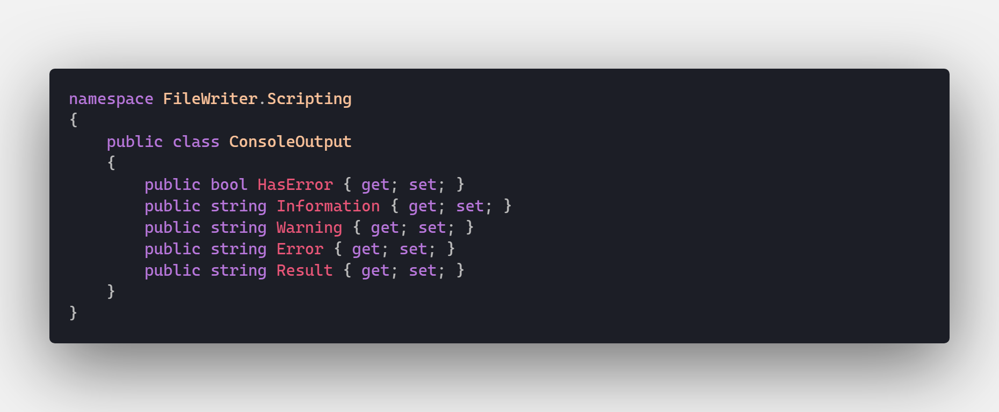

# File Write - PowerShell SDK with Web API and Angular

This repository is a simple demonstration of how to use a PowerShell script embedded in a .NET Core class library, exposing the functionality of the script to a Web API / Angular web app. This application has been kept very simple to emphasize how data flows and executes between each technology.

  
*click to open*  

All of the PowerShell-related features are contained in the [src/FileWriter.Scripting](src/FileWriter.Scripting) library. It uses the [Microsoft.PowerShell.SDK](https://www.nuget.org/packages/Microsoft.PowerShell.SDK/) to execute an embedded `.ps1` script in a PowerShell Core runspace on the machine that is hosting the .NET Core app.

[**FileWriter.Scripting/Scripts/Write-Text.ps1**](src/FileWriter.Scripting/Scripts/Write-Text.ps1)

This simple script takes a `path` and a `value` parameter to create a text file at the specified path with the specified value.

In order to access the PowerShell script, it needs to be included in the class library as an **EmbeddedResource**.

[**FileWriter.Scripting/FileWriter.Scripting.csproj**](src/FileWriter.Scripting/FileWriter.Scripting.csproj)

  

Before getting into the functionality of the `.Scripting` library, there are three classes that need to be created to support three important aspects of this app:

* `WriterInput.cs` - Represents the input that will be provided to the script
* `ConsoleOutput.cs` - Represents the output the script will respond with
* `OutputPath.cs` - Allows the base path that files are written to to be configurable

[**FileWriter.Scripting/WriterInput.cs**](src/FileWriter.Scripting/WriterInput.cs)  

  

[**FileWriter.Scripting/ConsoleOutput.cs**](src/FileWriter.Scripting/ConsoleOutput.cs)  

  

[**FileWriter.Scripting/OutputPath.cs**](src/FileWriter.Scripting/OutputPath.cs)  

  

Now, all of the infrastructure needed to define the PowerShell interactions is in place. The logic for these interactions is contained in [ScriptExtensions.cs](src/FileWriter.Scripting/Extensions/ScriptExtensions.cs).

